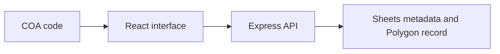

# TrueCOA Integrated Snapshot — Project Brief

## At a glance

| Field | Value |
|---|---|
| Portfolio area | Provenance systems |
| Repository | [jjshay/gauntlet-coa](https://github.com/jjshay/gauntlet-coa) |
| Status | Source available; runtime not revalidated in this documentation review |
| Evidence review | 2026-09-11; [commit 73e1496](https://github.com/jjshay/gauntlet-coa/tree/73e1496b5de8a1a66923f4dfcfa7a5cba343dfa1) |

## Problem and intended value

Certificate verification spans a customer interface, operational records, and a blockchain lookup.

The intended value is a repeatable workflow whose inputs, transformations, and outputs can be inspected. Use the evidence below to distinguish implementation from business outcomes.

## Architecture and data flow

COA code → React interface → Express API → Sheets metadata and Polygon record.

## Implementation evidence

| Source | Reading purpose |
|---|---|
| [backend/index.js](../backend/index.js) | Application entry point, interface, or integration boundary. |
| [frontend/src/App.jsx](../frontend/src/App.jsx) | Application entry point, interface, or integration boundary. |

The links above point to the current repository. The review reference identifies the version used to prepare this brief.

## Setup and operation

Use the existing [README](../README.md) for setup and operating commands. Configuration and dependency references: [package.json](../package.json), [.env.example](../.env.example).

Start with sample or fixture inputs. Where external services are involved, configure a test account and check the distinction between a local preview, a generated artifact, and a remote write. Credentials and operational datasets are environment-specific.

## Validation and outcomes

**Review result:** Repository tree and referenced source reviewed. Existing application tests, hosted deployments, paid providers, and external mutations were not re-run in this documentation review.

No conventional test suite was identified in the reviewed repository tree; validation should begin with the next improvement below.

The source implements the workflow described above. No new revenue, accuracy, conversion, or production-uptime result is asserted by this documentation update.

Documentation itself is checked by `python3 scripts/check_project_docs.py`; that check validates this structure and its source references, not application behavior.

## Decisions and limitations

A blockchain record preserves a claim's history; it does not independently establish the physical artwork's authenticity.

Keep provider-dependent observations dated and separate from deterministic transformations. State which assumptions a demonstration uses and which integrations it actually exercises.

## Interview talking points

- **Problem and product judgment:** Explain why this workflow mattered to its intended operator: Certificate verification spans a customer interface, operational records, and a blockchain lookup.
- **Technical walkthrough:** Trace one concrete input through this sequence: COA code → React interface → Express API → Sheets metadata and Polygon record.
- **Engineering tradeoff:** A blockchain record preserves a claim's history; it does not independently establish the physical artwork's authenticity.
- **Evidence and ownership:** Open the source links above, identify the specific design or implementation decisions you personally drove, and distinguish AI-assisted implementation from measured operating results.
- **What comes next:** Use truecoa as the current integrated reference and compare this related snapshot before applying future changes.

## Next improvements

Use truecoa as the current integrated reference and compare this related snapshot before applying future changes.

Record any follow-up result with a date, exact command or evaluation method, input scope, observed output, and limitations. Update `project.json` alongside this brief.

## Related projects

- [TrueCOA API](https://github.com/jjshay/gauntlet-coa-backend) — Provenance systems.
- [TrueCOA Verification Portal](https://github.com/jjshay/gauntlet-coa-frontend) — Provenance systems.
- [TrueCOA Print Generator](https://github.com/jjshay/gauntlet-coa-generator) — Provenance systems.
- [TrueCOA](https://github.com/jjshay/truecoa) — Provenance systems.

Some related repositories require authorized GitHub access.
